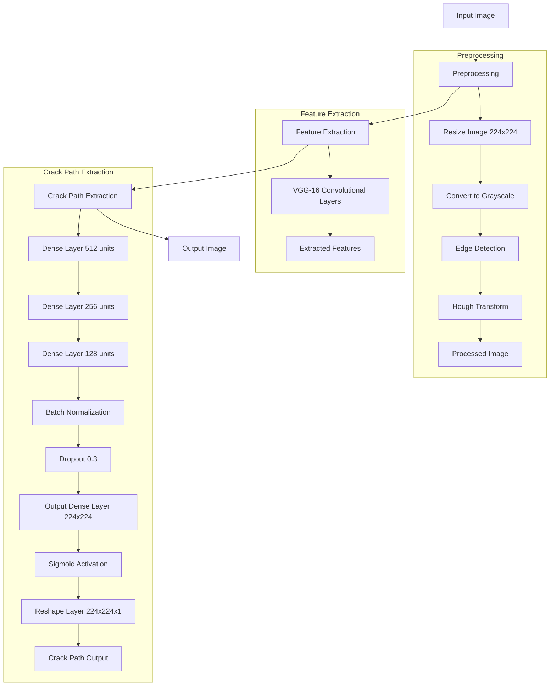

# DL-Image-Processing-Crack-Detection
Image Processing for Crack Detection  using XFEM, Machine Learning &amp; Deep Learning Techniques

```mermaid
flowchart TB
    A[Input Image] --> B[Preprocessing]
    B --> C[Feature Extraction]
    C --> D[Crack Path Extraction]
    D --> E[Output Image]

    subgraph Preprocessing
        B --> B1[Resize Image 224x224]
        B1 --> B2[Convert to Grayscale]
        B2 --> B3[Edge Detection]
        B3 --> B4[Hough Transform]
        B4 --> B5[Processed Image]
    end

    subgraph "Feature Extraction"
        C --> C1[VGG-16 Convolutional Layers]
        C1 --> C2[Extracted Features]
    end

    subgraph "Crack Path Extraction"
        D --> D1[Dense Layer 512 units]
        D1 --> D2[Dense Layer 256 units]
        D2 --> D3[Dense Layer 128 units]
        D3 --> D4[Batch Normalization]
        D4 --> D5[Dropout 0.3]
        D5 --> D6[Output Dense Layer 224x224]
        D6 --> D7[Sigmoid Activation]
        D7 --> D8[Reshape Layer 224x224x1]
        D8 --> D9[Crack Path Output]
    end
```
