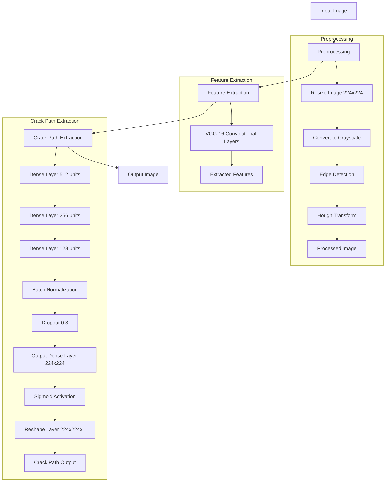
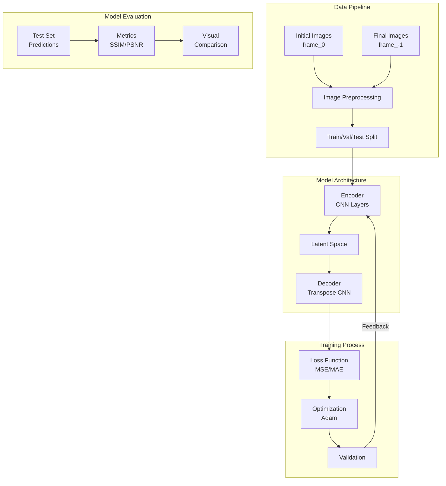

# Deep Learning for Image Processing & Crack-Detection
Image Processing for Crack Detection  using XFEM, Machine Learning &amp; Deep Learning Techniques

For Extended Summary, Refer to [Notes](/notes.md)

*_The Repo is obviously not well structured(at least to my liking), This will be imporved and properly documented after the research reaches it's ideal stages and a paper is submitted_*

### Summarized Poster:

## Updated High-Level Architecture

